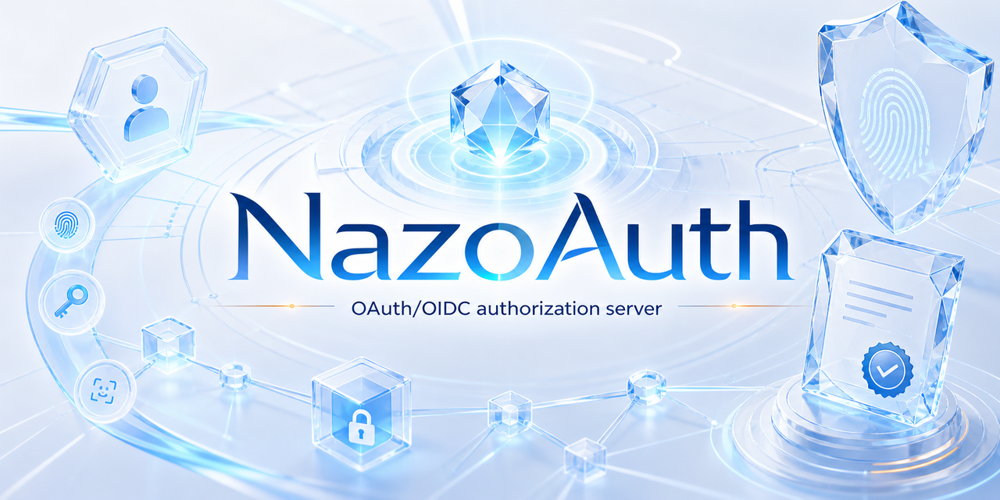

<p align="center">
  
</p>

# Nazo Auth Server

[](https://github.com/nazozero/NazoAuth/actions/workflows/code-quality.yml)
[](https://github.com/nazozero/NazoAuth/actions/workflows/codeql.yml)
[](https://github.com/nazozero/NazoAuth/actions/workflows/dependency-review.yml)
[](https://github.com/nazozero/NazoAuth/actions/workflows/conformance-security.yml)
[](https://github.com/nazozero/NazoAuth/actions/workflows/oidf-conformance-full.yml)
[](https://app.codecov.io/gh/nazozero/NazoAuth)

[中文文档](README.zh-CN.md) · [Documentation](#documentation) · [Quick start](#quick-start) · [Security](SECURITY.md)

Nazo Auth Server is a self-hosted OAuth 2.x / OAuth 2.1-aligned and OpenID
Connect authorization server written in Rust. It is built for same-origin
deployments where the issuer, browser UI, passkeys, CORS, cookies, and protocol
endpoints share one public origin.

The project includes the authorization server, a compact identity/admin surface,
local signing key management, WebAuthn/passkeys, MFA, SCIM, and Rust
resource-server verification libraries. Modular external-provider login is
tracked in the future roadmap rather than advertised as a current default
capability. It uses PostgreSQL for durable state and Valkey for short-lived
protocol state.

## Status

| Item | Value |
| --- | --- |
| Package | `nazo-oauth-server` |
| Version | `0.1.0` |
| License | AGPL-3.0-or-later |
| Language | Rust 2024 |
| Runtime services | PostgreSQL, Valkey |
| Certified public issuer | `https://auth.nazo.run` |
| Default deployment model | same-origin |

## Quality Signals

Project quality is tracked through direct, auditable checks rather than a
composite score:

| Signal | Evidence |
| --- | --- |
| Rust quality gate | `cargo fmt --check`, `cargo check --workspace --all-targets --all-features --locked`, `cargo clippy -D warnings`, migrations, and the complete workspace test suite in `code-quality`. |
| Static security analysis | CodeQL Rust analysis with `security-extended` and `security-and-quality` queries. |
| Dependency policy | GitHub dependency review, `cargo audit`, and `cargo deny` over advisories, bans, licenses, and sources. |
| Runtime security behavior | Real HTTP E2E, load/race gate, and Valkey outage injection in `conformance-security`. |
| Protocol conformance | Current 22-plan OIDF/FAPI workflow plus archived official 21-plan matrix evidence. |
| Coverage trend | Codecov LCOV upload from the dedicated coverage workflow. |
| Release provenance | CycloneDX SBOM, Trivy image scan, Sigstore signing, and GitHub artifact attestations. |

## Standards

Nazo Auth Server implements the core standards expected from a modern
authorization server. Compatibility exceptions are documented instead of hidden
behind discovery metadata.

IETF and RFCs:

| Standard | Implementation |
| --- | --- |
| [RFC 7009](https://www.rfc-editor.org/rfc/rfc7009), Token Revocation | `/revoke` |
| [RFC 7523](https://www.rfc-editor.org/rfc/rfc7523), JWT Client Authentication and JWT Bearer Grant | `private_key_jwt` and client-bound JWT bearer grant |
| [RFC 7591](https://www.rfc-editor.org/rfc/rfc7591), Dynamic Client Registration | authenticated `/register` and protected client configuration lifecycle, including constrained `jwks_uri` and `request_uris` metadata |
| [RFC 7636](https://www.rfc-editor.org/rfc/rfc7636), PKCE | S256 PKCE |
| [RFC 7662](https://www.rfc-editor.org/rfc/rfc7662), Token Introspection | `/introspect` |
| [RFC 8252](https://www.rfc-editor.org/rfc/rfc8252), OAuth 2.0 for Native Apps | public native-app redirect URI policy: claimed HTTPS, private-use schemes, and loopback HTTP with port variance |
| [RFC 8414](https://www.rfc-editor.org/rfc/rfc8414), Authorization Server Metadata | `/.well-known/oauth-authorization-server` |
| [RFC 8628](https://www.rfc-editor.org/rfc/rfc8628), Device Authorization Grant | `/device_authorization`, `/device`, and `device_code` token grant behind `ENABLE_DEVICE_AUTHORIZATION_GRANT` |
| [RFC 8693](https://www.rfc-editor.org/rfc/rfc8693), Token Exchange | bounded local access-token exchange for clients registered with `urn:ietf:params:oauth:grant-type:token-exchange` |
| [RFC 8705](https://www.rfc-editor.org/rfc/rfc8705), OAuth 2.0 mTLS | mTLS client auth and sender-constrained tokens |
| [RFC 8707](https://www.rfc-editor.org/rfc/rfc8707), Resource Indicators | authorization/PAR/token `resource` handling with JWT `aud` binding and refresh-token audience narrowing |
| [RFC 9068](https://www.rfc-editor.org/rfc/rfc9068), JWT Access Tokens | JWT access-token shape for resource servers |
| [RFC 9101](https://www.rfc-editor.org/rfc/rfc9101), JAR | signed request objects where enabled, including exact dynamically registered HTTPS `request_uri` on the baseline profile; FAPI remains PAR-only |
| [RFC 9126](https://www.rfc-editor.org/rfc/rfc9126), PAR | `/par` |
| [RFC 9396](https://www.rfc-editor.org/rfc/rfc9396), Rich Authorization Requests | behind `ENABLE_AUTHORIZATION_DETAILS` |
| [RFC 9449](https://www.rfc-editor.org/rfc/rfc9449), DPoP | proof validation and sender-constrained tokens |
| [RFC 9700](https://www.rfc-editor.org/rfc/rfc9700), OAuth 2.0 Security BCP | code-only authorization responses, no password or implicit grants, PKCE, redirect URI binding, bearer-token protections, and sender-constrained-token hardening |
| [RFC 9701](https://www.rfc-editor.org/rfc/rfc9701), JWT Response for OAuth Token Introspection | profile-gated signed and nested encrypted introspection responses |
| [RFC 9728](https://www.rfc-editor.org/rfc/rfc9728), Protected Resource Metadata | `/.well-known/oauth-protected-resource` and `/.well-known/oauth-protected-resource/fapi/resource` |
| OAuth 2.1 draft direction | OAuth 2.1-style defaults with explicit compatibility switches |

OpenID Foundation:

<p align="center">
  <a href="https://openid.net/certification/certified-openid-providers-profiles/">
    
  </a>
</p>

| Specification | Implementation |
| --- | --- |
| [OpenID Connect Core 1.0](https://openid.net/specs/openid-connect-core-1_0.html) | ID Token, JSON/signed/encrypted UserInfo, claims, authorization code flow |
| [OpenID Connect Discovery 1.0](https://openid.net/specs/openid-connect-discovery-1_0.html) | `/.well-known/openid-configuration` |
| [OAuth 2.0 Form Post Response Mode](https://openid.net/specs/oauth-v2-form-post-response-mode-1_0.html) | secure no-store `response_mode=form_post` responses on the baseline profile |
| [OpenID Connect Third-Party Initiated Login 1.0](https://openid.net/specs/openid-connect-3rd-party-initiated-login.html) | HTTPS `initiate_login_uri` dynamic registration metadata |
| [OpenID Connect RP-Initiated Logout 1.0](https://openid.net/specs/openid-connect-rpinitiated-1_0.html) | `/logout` |
| [OpenID Connect Back-Channel Logout 1.0](https://openid.net/specs/openid-connect-backchannel-1_0.html) | signed logout tokens with durable outbox delivery |
| [JWT Secured Authorization Response Mode](https://openid.net/specs/oauth-v2-jarm.html) | signed JARM and optional per-client nested JWE where the request/profile selects JARM |
| [FAPI 2.0 Security Profile Final](https://openid.net/specs/fapi-security-profile-2_0-final.html) | `fapi2-security` profile |
| [FAPI 2.0 Message Signing Final](https://openid.net/specs/fapi-message-signing-2_0-final.html) | signed authorization request, JARM, and signed introspection profile support |

Other protocol surfaces:

| Standard | Implementation |
| --- | --- |
| SCIM 2.0 provisioning with [RFC 9865](https://www.rfc-editor.org/rfc/rfc9865) / [RFC 9967](https://www.rfc-editor.org/rfc/rfc9967) | default-tenant user provisioning; index pagination remains the default and forward cursor pagination uses opaque 10-minute actor/query-bound cursors; default-closed RFC 9967 notice SETs use a transactional outbox and RFC 8936 poll delivery |
| WebAuthn | passkey registration and login |

Emerging protocols are tracked through the
[M8 watchlist governance review](docs/conformance/2026-07-11-m8-watchlist-governance.md).
That review records product and conformance entry gates; it does not claim
runtime support for the deferred candidates.

## Certification

Nazo Auth Server is listed by the OpenID Foundation as
`Nazo Auth Server 0.1.0`, dated `09-Jun-2026`.

- [OpenID Connect Certified providers](https://openid.net/certification/#OPs)
- [Certified OpenID Provider profiles](https://openid.net/certification/certified-openid-providers-profiles/)
- [Certified FAPI 2.0 OP Security Profile Final and Message Signing Final](https://openid.net/certification/certified-fapi-2-0-op-security-profile-final-message-signing-final/)

OpenID Foundation Conformance Suite result URLs:

| Result | URL |
| --- | --- |
| OIDC Basic OP | <https://www.certification.openid.net/plan-detail.html?plan=Srk6iaVDVcqO5> |
| OIDC Config OP | <https://www.certification.openid.net/plan-detail.html?plan=fGiz8QZYR1LVy> |
| Latest 21-plan official matrix | [docs/conformance/2026-07-11-m7-official-encrypted-responses-oidf-results.md](docs/conformance/2026-07-11-m7-official-encrypted-responses-oidf-results.md#plan-ids) |
| Current 22-plan repository matrix | [docs/conformance/oidf-full-matrix.md](docs/conformance/oidf-full-matrix.md) |
| OIDF matrix scope | [docs/conformance/oidf-full-matrix.md](docs/conformance/oidf-full-matrix.md) |
| Latest private full-matrix regression | [docs/conformance/2026-07-01-tp-ps-full-matrix.md](docs/conformance/2026-07-01-tp-ps-full-matrix.md) |

The latest official full matrix tested `https://auth.nazo.run` from workflow
head SHA `371b4f6e61674c4d1bd9ace7ba5b518314c8ff0f`. It ran the 21-plan matrix in
the 19+2 parallel-isolated layout and exported 640 modules: 632 passed, 6
expected review states, 2 expected skips, and no failed module, condition
failure, or warning. It is therefore not zero-SKIPPED evidence.

The latest private full-matrix regression tested runtime commit `31e8f9f`, ran
all 16 plans and 578 modules, and reported `0 failures` and `0 warnings`.

## Features

- Authorization code + PKCE, refresh tokens, client credentials, bounded JWT
  bearer grant, bounded Token Exchange, revocation, introspection,
  signed/encrypted introspection, discovery, protected resource metadata, JWKS,
  JSON/signed/encrypted UserInfo, signed/encrypted JARM, PAR, JAR, DPoP, and
  mTLS.
- Runtime profiles: `oauth2-baseline`, `fapi2-security`,
  `fapi2-message-signing-authz-request`, `fapi2-message-signing-jarm`, and
  `fapi2-message-signing-introspection`.
- Local users, profiles, OAuth clients, grants, access requests, TOTP MFA,
  backup codes, remembered MFA, WebAuthn/passkeys, and SCIM provisioning.
- Local signing key lifecycle with prepublish, active, grace, and retired
  states. External-command signing is available for KMS/HSM integrations.
- Framework-independent Rust resource-server verifier plus the project's Actix
  HTTP integration. Historical Axum/Tower and tonic adapters are not shipped.
- Release security workflows for CodeQL, dependency review, cargo audit,
  cargo deny, SBOM generation, Trivy image scanning, keyless signing, and
  provenance attestations.

## Quick start

Requirements:

- The exact Rust stable version pinned by `rust-toolchain.toml`
- PostgreSQL 18 or a compatible PostgreSQL server
- Valkey 8 or a compatible Redis protocol server
- Docker or Podman for the local integration stack

Run with Docker Compose:

```sh
cp .env.yaml.example .env.yaml
docker compose up -d nazo_oauth_server
curl -fsS http://127.0.0.1:8000/health
curl -fsS http://127.0.0.1:8000/.well-known/openid-configuration
```

Run directly on the host after pointing `.env.yaml` at reachable PostgreSQL and
Valkey services:

```sh
cargo run --bin nazo-oauth-migrate
cargo run --bin nazo-oauth-server
```

## Configuration

Configuration is intentionally small for new deployments:

```yaml
BIND: "0.0.0.0:8000"
PUBLIC_BASE_URL: "https://auth.example.com"
DATABASE_URL: "postgresql://nazo_oauth:<password>@postgres:5432/oauth"
VALKEY_URL: "redis://valkey:6379/0"
DATA_DIR: "/var/lib/nazo_oauth"
AUTHORIZATION_SERVER_PROFILE: "oauth2-baseline"
RUST_LOG: "info"
```

`PUBLIC_BASE_URL` drives the same-origin defaults:

| Value | Default rule |
| --- | --- |
| `ISSUER` | `PUBLIC_BASE_URL` |
| `FRONTEND_BASE_URL` | `PUBLIC_BASE_URL + "/ui/"` |
| `CORS_ALLOWED_ORIGINS` | origin of `PUBLIC_BASE_URL` |
| `COOKIE_SECURE` | `true` for HTTPS issuers |
| `PASSKEY_ORIGIN` and `PASSKEY_RP_ID` | derived from issuer |
| `PROTECTED_RESOURCE_IDENTIFIER` | `ISSUER + "/fapi/resource"` |

`DATA_DIR` drives persistent local file paths:

| Value | Default rule |
| --- | --- |
| `JWK_KEYS_DIR` | `DATA_DIR + "/keys"` |
| `AVATAR_STORAGE_DIR` | `DATA_DIR + "/avatars"` |

Advanced settings still exist for compatibility and specialized deployments.
They are documented in [docs/operations/configuration.md](docs/operations/configuration.md).

## Default boundaries

The following capabilities are outside the default authorization-server surface
and are not advertised unless implemented, tested, and explicitly enabled:

- Dynamic Client Registration / RFC 7591 and Client Configuration Management
  / RFC 7592 unless `ENABLE_DYNAMIC_CLIENT_REGISTRATION=true`; public
  registration deployments should protect `/register` with an initial access
  token.
- Device Authorization Grant / RFC 8628 unless `ENABLE_DEVICE_AUTHORIZATION_GRANT=true`.
- External-token, refresh-token, or ID-token Token Exchange profiles.
- Modular third-party login providers such as QQ, WeChat, Google, Microsoft, or
  enterprise SAML; these are roadmap items until provider-specific adapters,
  configuration gates, account linking, and E2E/negative tests exist.
- Request-level dynamic tenant or issuer routing.
- RFC 9701 encrypted introspection responses outside the signed-introspection
  profile, or without per-client JWE response metadata.
- UserInfo or JARM encryption without supported per-client JWE metadata and a
  unique matching public encryption key.

See [docs/project/roadmap.md](docs/project/roadmap.md) for the current scope record.

## Documentation

| Topic | Link |
| --- | --- |
| Documentation index | [docs/README.md](docs/README.md) |
| Workspace architecture | [docs/project/architecture.md](docs/project/architecture.md) |
| Configuration | [docs/operations/configuration.md](docs/operations/configuration.md) |
| Deployment | [docs/operations/deployment.md](docs/operations/deployment.md) |
| Chinese deployment guide | [docs/operations/deployment.zh-CN.md](docs/operations/deployment.zh-CN.md) |
| Conformance records | [docs/conformance](docs/conformance) |
| Performance benchmarks | [docs/performance/performance-capacity-curve.md](docs/performance/performance-capacity-curve.md) |
| OAuth/OIDC/FAPI best-practice matrix | [docs/protocol/rfc-compliance-matrix.md](docs/protocol/rfc-compliance-matrix.md) |
| OAuth/OIDC/FAPI future roadmap | [docs/protocol/oauth-best-practice-implementation-plan.zh-CN.md](docs/protocol/oauth-best-practice-implementation-plan.zh-CN.md) |
| Profile matrix | [docs/protocol/profile-matrix.md](docs/protocol/profile-matrix.md) |
| Ecosystem client onboarding | [docs/features/ecosystem-onboarding.md](docs/features/ecosystem-onboarding.md) |
| Threat model | [docs/security/threat-model.md](docs/security/threat-model.md) |
| Release security | [docs/operations/release-security.md](docs/operations/release-security.md) |
| PostgreSQL and Valkey operations | [docs/operations/ha-operations.md](docs/operations/ha-operations.md) |
| Resource server verifier | [docs/features/resource-server-verifier.md](docs/features/resource-server-verifier.md) |
| SCIM | [docs/features/scim.md](docs/features/scim.md) |
| Federation | [docs/features/federation.md](docs/features/federation.md) |
| Passkeys | [docs/features/passkeys.md](docs/features/passkeys.md) |
| MFA | [docs/features/mfa.md](docs/features/mfa.md) |
| Security policy | [SECURITY.md](SECURITY.md) |
| Changelog | [CHANGELOG.md](CHANGELOG.md) |

## Development

```sh
cargo fmt --check
cargo check --workspace --all-targets --all-features --locked
cargo clippy --workspace --all-targets --all-features --locked -- -D warnings
cargo test --workspace --all-features --locked
```

HTTP and concurrency checks:

```sh
python scripts/full_real_request_e2e.py
python scripts/full_real_request_load.py
```

Windows coverage runs are documented in
[docs/coverage/codecov-docker-runbook.md](docs/coverage/codecov-docker-runbook.md).

## License

AGPL-3.0-or-later. See [LICENSE](LICENSE).
