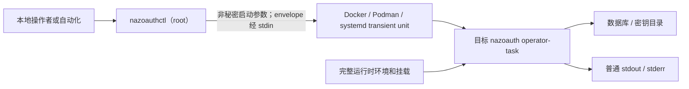
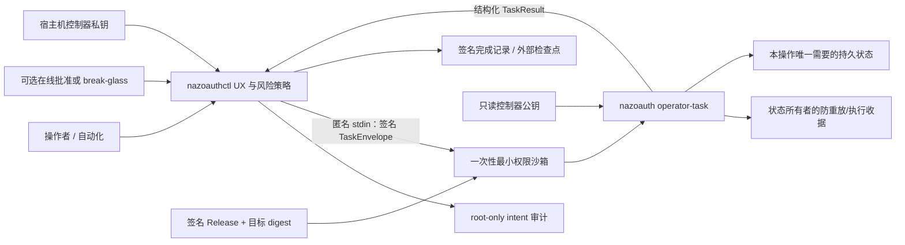

# NazoAuth 管理控制面安全交互与易用性计划书

状态：实施与验证中；第 18 节唯一远端验收未完成，不构成完成声明
日期：2026-08-01
证据基线：`codex/cosign-private-staging` 当前工作树；最终精确 commit 只在第 18 节验收后记录
配套任务书：[operator-task-protocol-implementation-task.zh-CN.md](../project/operator-task-protocol-implementation-task.zh-CN.md)

## 1. 决策摘要

本计划解决 `nazoauthctl` 与目标版本 `nazoauth` 之间的特权操作交互。我们保留现有的
一次性任务进程模型，不增加常驻 HTTP、Unix Socket RPC 或内部 OAuth 服务。控制器通过
匿名标准输入向目标版本发送一次性、带签名、带时效、绑定部署和目标制品的能力信封；
目标应用只接受封闭的操作类型，在验证身份、授权、防重放和运行边界后执行，并返回
结构化结果。每个会改变状态的操作同时产生可关联、脱敏、可验证的审计证据。

计划采用“选项 2：签名能力信封与操作级隔离”。它比仅修补当前命令调用更能约束未来
能力漂移，又不承担常驻控制服务的长期攻击面和运维成本。

最终产品体验保持简单：首次安装自动生成部署身份、控制器身份、审计身份、秘密和默认
策略；用户日常只需要理解 `install`、`status`、`doctor`、`update`、`keys` 和 `audit`
六组命令。只有外部数据库、外部密钥系统、DNS/TLS、在线管理员批准或外部审计目的地
这类无法由程序安全推断的事实才要求用户配置。

本文件同时是实施约束和验收计划，不是完成声明。只有第 18 节全部满足并保留对应证据后，才能
宣布该交互达到计划中的安全与易用性目标。

## 2. 证据基础与当前事实

我检查了当前控制器、应用 CLI、密钥管理入口、部署挂载、架构文档和审计约束。当前工作
树包含尚未提交的生命周期控制器改造，因此这里记录的是可复核的工作树快照，不把当前
`HEAD` 单独称为完整实现版本。开始编码前必须重新检查漂移。

| 证据 | 类型 | 当前观察 | SHA-256 |
| --- | --- | --- | --- |
| `crates/nazoauthctl/src/runtime.rs` | 已观察 | `app_task` 以普通参数调用目标二进制；容器任务复用完整运行时环境和挂载 | `5c7f411d53c70d12bd920f1dcce86c15aad779b3c27adf5910c9db5d5673ba56` |
| `crates/nazoauthctl/src/controller.rs` | 已观察 | `migrate` 与 `keys` 需要 root，并委派给当前目标版本 | `fd982394e41aa1b66cc5e8f3b0a1c4dfb31b2af9f13098da4d5747460639855b` |
| `crates/nazoauthctl/src/install.rs` | 已观察 | 数据库和 Valkey URL 已使用只读秘密文件挂载，但任务仍继承 avatars、UI、bootstrap 等无关挂载 | `b3d5666cb3e56d203dbed716cdc5b4b7720f0094348a341e351862eeb91a3e9b` |
| `crates/authorization-server/src/cli.rs` | 已观察 | `nazoauth` 暴露 `server`、`migrate`、`keyctl`；服务器启动仍自动迁移 | `5b1faf65556387dcc126bdad8d9bfb2a56e53d7765c4862b5bf8b1f8b6650dd8` |
| `crates/authorization-server/src/keyctl.rs` | 已观察 | 密钥命令接受自由 CLI 参数并加载完整 Settings；尚无控制器请求认证和请求级防重放 | `5384dc23112bc4a40e4fc7e558f1d3e2d3e7100aaa49a8fcaea2e07cca2d86de` |
| `docs/project/architecture.md` | 已观察 | 已明确 ctl 管宿主机生命周期、app 管版本耦合语义 | `e9b1df080142c17e9363955197299daf316057d38fda20cbd221048f30631b22` |
| `docs/security/security-events.md` | 已观察 | 已有封闭、结构化、禁止原始凭据的 `nazo.audit.v1` 约束 | `58620a3ce6c8696e1733074ea41a1d5b4337f2af4f190c0eb3622e81b45cf118` |
| `docs/security/threat-model.md` | 已观察 | 当前威胁模型尚未覆盖 ctl、容器引擎、任务容器和操作审计边界 | `2853aae7063d20811aaaba249945ad6f2e39281dec82014445a513d220850728` |

从这些事实可以推导出三个结构性问题，但不能把它们表述成已经被利用的漏洞：

1. 当前授权主要来自“调用者是 root 且能启动目标进程”，应用端没有独立验证这次请求是否
   来自本部署的正式控制器。
2. 当前任务容器拥有超出具体操作所需的挂载和网络能力，最小权限依赖调用者约定，而不由
   类型和运行时策略强制。
3. 当前应用安全审计面向 OAuth/身份业务事件，尚没有覆盖控制器意图、应用接受、执行结果
   和重放拒绝的闭环。

## 3. 第一性原则

### 3.1 安全不是额外步骤，而是有效操作的定义

一个操作只有在主体、意图、目标、权限、时效、防重放、执行环境和证据同时有效时才存在。
不能先执行，再用日志补充“安全”；也不能因为进程由 root 启动就跳过应用自己的授权判断。

### 3.2 容器可丢弃，持久状态不可隐式存在于容器中

运行容器和任务容器都不是状态所有者。配置、部署身份、密钥、应用数据、迁移账本和审计
检查点必须位于明确的持久化边界。任务容器不得通过修改自身可写层产生需要保留的结果。

### 3.3 权限必须由操作的真实依赖推导

“与生产容器使用相同挂载和网络”便于兼容，但不是安全边界。每种操作必须声明自己读取、
写入和联网的真实需求；未声明的挂载、Linux capability、端口和网络一律不存在。

### 3.4 版本耦合语义必须由目标版本应用执行

迁移、密钥格式和应用状态规则继续属于 `nazoauth`。`nazoauthctl` 只构造经过授权的意图、
选择并验证目标版本、建立最小执行边界、观察结果并负责生命周期事务，不能复制应用规则。

### 3.5 易用性是安全控制的一部分

如果正确路径需要手工生成密钥、拼装容器参数或编辑秘密文件，用户会绕开控制面。默认路径
必须自动生成可安全生成的值，提供清楚的进度、失败原因、自动回滚和下一步，同时保留显式
覆盖。任何无法安全推断的外部信任事实必须坦率地要求用户提供，不能猜测。

### 3.6 审计必须脱敏、可关联、可验证，但不能夸大不可篡改性

审计记录只保留闭合字段和摘要；同一个 request ID 串联控制器与应用证据。本地哈希链只能
发现局部损坏。若 root、私钥和全部本地日志同时失陷，只有已经发送到独立信任域的签名
检查点才能提供强篡改可见性。

### 3.7 宿主机 root 和容器引擎是最终本地信任根

应用协议可以阻止普通本地用户、错误控制器、旧请求、错误部署和过宽任务能力，但不能在
宿主机 root 或 Docker/Podman 控制面已完全失陷后恢复真实性。高保证部署应通过 rootless
Podman、SELinux/AppArmor、TPM/PKCS#11/HSM 和外部审计继续缩小该残余风险。

## 4. 目标、约束与非目标

### 4.1 目标

- 每个应用任务都能证明由本部署控制器授权，并绑定唯一部署、目标版本和精确操作。
- 秘密不经过进程参数、普通环境变量、临时文件、Docker inspect 输出或审计字段。
- 状态变更具备防重放、幂等恢复和与持久状态相联系的执行收据。
- Docker、Podman 和 systemd/宿主机模式共享同一协议语义和验收标准。
- 新安装默认零秘密配置；用户仍可指定外部 PostgreSQL、Valkey、KMS/HSM 和审计系统。
- 日常路径简短、可发现、可脚本化，错误信息能直接指出下一步。
- 更新失败能够自动回滚；中断后重试不会重复产生密钥或重复迁移。

### 4.2 约束

- 保持两个发布二进制：`nazoauth` 和 `nazoauthctl`。
- 保持一次性任务模型，不引入常驻控制面服务。
- 不要求 NazoAuth 正在在线运行才能进行迁移、恢复或 break-glass 操作。
- 不让 `nazoauthctl` 依赖完整授权服务器实现。
- 不因控制面协议而改变对外 OAuth/OIDC/FAPI 行为。
- 默认支持当前声明的 Linux x86_64 与 aarch64 部署边界；新增平台必须有真实运行证据。

### 4.3 非目标

- 不承诺抵抗已经控制宿主机 root、内核或容器引擎的攻击者。
- 不把本地任务协议宣传成新的 OAuth 标准、OIDF 认证项目或远程证明。
- 不自动猜测 DNS 所有权、TLS 证书链、外部数据库可恢复性、HSM 策略或 SIEM 身份。
- 不让操作日志保存原始 stdout/stderr、私钥、密码、URL 凭据或外部 signer 凭据。
- 不为了“统一”而让所有操作依赖 PostgreSQL；重放状态应由实际状态所有者持久化。

## 5. 最终能力边界

| 组件 | 应当拥有的能力 | 明确禁止拥有的能力 |
| --- | --- | --- |
| `nazoauthctl` | 用户交互、默认值生成、部署身份、控制器签名、发布验证、备份、目标选择、沙箱构造、生命周期事务、外部审计检查点 | OAuth/OIDC 业务规则、迁移内容、密钥文件格式、任意远程命令、直接修改应用状态 |
| `nazo-operator-protocol`（建议新增共享 crate） | 两个真实消费者共享的封闭类型、JWS 签名/验证、时间与 audience 校验、操作风险分类、结果与错误码 | 容器调用、文件系统布局、数据库迁移、KeyManager、HTTP 服务 |
| `nazoauth operator-task` | 验证控制器请求、执行封闭操作、请求级防重放、持久执行收据、结构化结果 | 接受任意 shell/参数、管理发布、启动/删除容器、读取控制器私钥 |
| `nazo-key-management` | 密钥状态转换、原子文件更新、与密钥状态绑定的请求收据 | 控制器身份、容器策略、交互提示 |
| `nazo-postgres` migration owner | 迁移锁、迁移账本、迁移结果 | 控制器 UI、密钥生命周期 |
| Docker/Podman/systemd | 实施用户、挂载、网络、只读根、capability 和进程生命周期隔离 | 决定某操作在业务上是否被授权 |
| 外部批准/审计系统（可选） | 管理员批准、人类归属、独立签名检查点 | 成为离线恢复的唯一依赖 |

新增共享 crate 有两个真实消费者，并拥有稳定的跨进程协议契约，因此符合工作区“只在真实
边界拆 crate”的规则。应用执行逻辑仍留在现有所有者中，不能搬入该 crate。

## 6. 威胁模型

### 6.1 需要防御的主体

- 没有 root 权限但能观察进程、日志或部分文件的本地用户。
- 获得旧请求、错误部署请求或篡改请求的攻击者。
- 误操作、脚本重复提交、进程崩溃后重试和并发控制器。
- 被污染的 stdout/stderr、外部 key ref、JWK 文件名或错误消息。
- 错误或旧版本控制器向不兼容目标发送任务。
- 权限配置错误导致任务读取或写入无关持久目录。
- 审计收集器或日志查看者不应获得的秘密。

### 6.2 必须作为信任根或外部边界管理的主体

- 宿主机内核和 root。
- Docker/Podman daemon 或 rootless Podman 用户边界。
- 经签名 Release 验证的 `nazoauthctl`、`nazoauth` 和目标镜像 digest。
- 首次安装后持久保存的部署 ID、控制器公钥和审计公钥。
- 外部 PostgreSQL、Valkey、KMS/HSM、在线批准服务与审计目的地。

### 6.3 主要攻击路径与控制

| 攻击路径 | 核心控制 | 残余风险 |
| --- | --- | --- |
| 伪造 ctl 请求 | 安装级 Ed25519 身份、严格 JWS `alg`/`typ`/`kid`、部署 audience | root 可窃取文件密钥；高保证模式需硬件密钥 |
| 请求重放 | 唯一 `jti`、短时效、状态所有者持久消费、幂等结果 | 持久介质整体回滚时需审计检查点检测 |
| 向错误部署执行 | deployment ID、target digest、config digest 绑定 | 克隆整机时必须重置或显式保留部署身份 |
| 参数/命令注入 | 封闭 enum、`deny_unknown_fields`、无 shell、无任意 argv 转发 | 外部命令 signer 仍需自身隔离 |
| 秘密泄露 | stdin 单消息、秘密文件/secret provider、输出白名单、日志脱敏测试 | root 仍可读取进程内存和本地秘密 |
| 任务越权读取/写入 | 操作级挂载/网络/用户模板、只读根、drop capabilities | 外部依赖网络策略取决于部署环境 |
| 结果伪造 | ctl 先验证目标制品并在结束后记录实际容器/二进制 digest；结果绑定请求摘要 | 无 TEE 时不是硬件远程证明 |
| 审计删除/重写 | 原子记录、哈希链、独立审计签名键、外部签名检查点 | 仅本地保存时无法抵抗完全 root 接管 |

## 7. 可证伪的安全不变量

后续任务和验收均引用以下编号。任何一项没有自动化或真实环境证据，都不能标记完成。

| 编号 | 不变量 |
| --- | --- |
| `INV-01` | 每个任务使用双层 target identity：ctl/runtime 在执行前后验证实际 OCI image digest 或宿主机二进制 digest；应用验证自身 embedded build/release identity。最终收据同时绑定两者，应用不得宣称自行证明 OCI digest。 |
| `INV-02` | 应用只信任安装时登记且仍有效的控制器公钥；算法和 key ID 不得由请求降级。 |
| `INV-03` | 请求必须绑定 deployment ID、协议版本、双层目标身份、版本化非秘密配置清单摘要、秘密 opaque revision/HMAC、精确 operation、`jti`、`iat`、`nbf`、`exp`。 |
| `INV-04` | 应用任务入口不接受 shell、任意子命令字符串或未声明字段。 |
| `INV-05` | ctl 生成或向 app/runtime 转交的私钥、密码、带凭据 URL、批准 token 和敏感 key ref 不出现在子进程 argv、普通环境、临时文件、inspect 或审计中；公共 CLI 不提供 secret argv 兼容例外。 |
| `INV-06` | 每个状态变更请求最多产生一次逻辑状态转换；重试返回已有结果或明确的 in-progress 状态。 |
| `INV-07` | 每个操作只得到其声明的只读/可写路径、用户、capability、网络和地址族。 |
| `INV-08` | 容器任务不发布端口，使用只读根文件系统、非 root 用户、`no-new-privileges` 和 `cap-drop=ALL`，例外必须逐项记录。 |
| `INV-09` | 高风险操作在执行前持久记录控制器 intent；应用接受、拒绝和结果使用同一 request ID。 |
| `INV-10` | 审计字段来自封闭 schema；敏感值只能记录不可逆摘要或非敏感标识。 |
| `INV-11` | 验签、授权、防重放、intent 持久化或必需审计失败时，状态变更 fail closed；不可逆 migration barrier 之前必须再次检查所有可满足前置条件。 |
| `INV-12` | 迁移、密钥状态和任务收据由真实状态所有者维护，不依赖不相关的通用数据库。 |
| `INV-13` | 离线迁移和恢复不依赖正在运行的 NazoAuth 或外部在线批准服务。 |
| `INV-14` | 默认安装自动生成可安全生成的身份、秘密和策略；外部信任事实必须显式提供。 |
| `INV-15` | 人类身份、控制器机器身份和 root 权限在审计中分别表达，不能把 `uid=0` 伪称为可证明的人类身份。 |
| `INV-16` | 协议版本不兼容时在任何状态修改前失败，并给出可操作的升级路径。 |
| `INV-17` | 请求与结果均有严格大小、时间和输出边界；stderr 不直接进入永久审计。 |
| `INV-18` | 管理安装启用控制器信任根后，不能通过公开的 legacy CLI 绕过相同授权和审计策略。 |

## 8. 当前与目标架构

### 8.1 当前结构



当前结构已经确保应用语义来自目标版本，但授权、最小权限和审计闭环主要依赖控制器调用
约定。最值得保留的是没有常驻控制通道；最需要改变的是 argv 和完整挂载的环境权力。

### 8.2 目标结构



| 变化 | 当前 | 目标 | 安全后果 | 成本 |
| --- | --- | --- | --- | --- |
| 请求 | 自由 argv | 签名、定时、部署绑定的封闭信封 | 消除任意命令面和错误部署请求 | 增加共享协议类型与密钥生命周期 |
| 身份 | root/engine 调用能力 | 控制器安装身份 + 可选人类批准 | 应用能独立拒绝伪造请求 | 首次安装和恢复需管理信任根 |
| 权限 | 完整生产挂载/网络 | 每操作沙箱模板 | 显著缩小任务失陷影响面 | Docker、Podman、systemd 都需验证 |
| 重放 | 生命周期锁为主 | request ID 持久状态机 | 崩溃重试不重复变更 | 各状态所有者需实现收据 |
| 审计 | 普通进程输出和业务事件 | intent、accept/reject、result 三段闭环 | 可追踪、可验证且不泄密 | 增加本地账本和外部检查点接口 |
| UX | 部分命令语义偏内部实现 | 稳定命令树、human/JSON 输出、doctor | 降低误操作和绕过概率 | 需要兼容和弃用周期 |

## 9. Operator Task Protocol v1

### 9.1 传输

- 容器模式只使用 `docker/podman run --rm -i` 的匿名 stdin/stdout；不分配 TTY，不开放端口。
- 宿主机模式使用 `systemd-run --pipe --wait --collect` 的 transient unit，而不是裸 `runuser`。
- 每个进程只接收一个请求并在一个结果后退出。
- 请求和结果默认最大 64 KiB；读取超限、额外帧、尾随数据或非 UTF-8 内容立即拒绝。
- 命令行只出现固定入口 `nazoauth operator-task`，不出现操作参数和秘密。
- stdout 只承载一份版本化 JSON 结果；诊断输出有大小上限并在进入审计前映射为封闭错误码。

不采用常驻 socket 的原因是它会引入监听生命周期、客户端认证、升级兼容、拒绝服务、连接
清理和额外可用性依赖。运维任务频率低，一次进程复制和签名验证的成本不在服务热路径。

### 9.2 请求格式与签发时点

请求使用严格 JWS，v1 仅接受 Ed25519/`EdDSA`。外层不得通过 `alg`、`jku`、`x5u` 或请求
提供的任意远程密钥改变验证策略。公钥从安装配置中的本地信任根选择。

JWS 只提供完整性和来源认证，不提供加密。请求的本地私密性来自匿名 pipe、受限 FD、
secret mount/secret provider、进程/容器权限和不落盘约束。私钥、密码、带凭据 URL、approval
token 和实际 signer credential 不得写入 JWS payload；任务负载只携带不含凭据的逻辑引用、
opaque secret revision 或 HMAC binding。必须传入的瞬时秘密只允许来自受限 stdin/FD、只读
secret mount 或已配置的 secret provider，不进入 argv、普通环境、日志、审计或持久化
envelope。

60 秒 envelope 不是准备阶段的长期凭据。ctl 必须先完成 Release trust 验证、制品下载与
digest 验证、实际 target identity 解析、网络创建/核验、精确挂载和沙箱参数构造、secret
channel 准备以及 intent 预提交；只有这些步骤全部成功后，才在 task 启动前最后生成 `jti`
和时间 claims、签名并立即写入匿名 stdin。准备失败不得产生可重放的已签名任务。

受保护头至少包含：

```json
{
  "alg": "EdDSA",
  "kid": "controller-019f...",
  "typ": "nazoauth-operator-task+jwt"
}
```

签名负载为封闭类型，概念形状如下：

```json
{
  "ver": 1,
  "iss": "urn:nazoauth:controller:019f...",
  "aud": "urn:nazoauth:deployment:019f...",
  "jti": "019f...",
  "iat": 1785494400,
  "nbf": 1785494395,
  "exp": 1785494460,
  "target": {
    "kind": "oci-image",
    "digest": "sha256:...",
    "revision": "..."
  },
  "config_manifest": {
    "schema": "nazo.operator-config.v1",
    "sha256": "...",
    "secret_revisions_hmac": "..."
  },
  "actor": {
    "kind": "local-root"
  },
  "operation": {
    "type": "keys.generate-local",
    "algorithm": "ES256",
    "purposes": ["credential"]
  }
}
```

默认签发有效期为 60 秒，允许有限时钟偏差；`exp` 只约束应用接受任务的时间，不要求长
迁移在过期前完成。具体上限由协议常量而不是用户任意配置决定。`config_manifest.sha256`
只覆盖版本化、规范化、封闭且非秘密的 effective configuration manifest，例如 deployment
ID、operation policy、逻辑 mount ID、network policy ID、协议版本和 target expectation；绝不
对包含秘密明文的完整配置直接 hash。秘密变化只通过 secret provider 给出的 opaque revision，
或以独立部署绑定密钥计算的 HMAC 进入 `secret_revisions_hmac`，避免离线字典验证低熵秘密。
解析器必须拒绝重复字段、
未知字段、未知 operation、未知算法、非规范时间、超长字符串、绝对宿主机路径和未声明的
外部输入。

JWS 在这里是本地能力信封，不是 OAuth access token，也不新增 token endpoint。我们复用
成熟的签名、audience、时效和 proof-of-possession 思维，但不把本地进程调用包装成网络授权
协议。

### 9.3 封闭操作集合

v1 只允许以下应用任务：

- `migrate.apply`
- `keys.list`
- `keys.validate`
- `keys.generate-local`
- `keys.register-external`

每种 operation 是独立 Rust enum variant，参数在编译期和反序列化边界验证。不能保留
`Vec<String>` 作为签名协议内部表示。公共 JWK 等输入通过只读、操作专属挂载提供，信封只
携带逻辑 input ID 和文件摘要；key ref 必须是不含凭据的逻辑引用，实际 credential 由配置
中的 secret provider 提供，并且在审计中只记录分类和摘要。

### 9.4 ctl 准备与签发顺序

1. 获取 lifecycle lock，加载并验证 root-owned deployment state。
2. 验证 Release manifest、签名身份、防降级策略、artifact/SBOM/provenance 和协议版本交集。
3. 解析并实测实际 OCI image digest 或宿主机二进制 digest。
4. 构造 operation capability profile，准备网络、挂载、非 root 用户、只读根和 secret channel。
5. 生成版本化非秘密 config manifest、secret revision/HMAC binding 和 intent 草稿。
6. 原子持久化 intent 并 fsync；失败则终止。
7. 在预计 task 能立即启动时最后生成 `jti/iat/nbf/exp`，签发 60 秒 JWS。
8. 立即启动 task 并通过匿名 stdin/FD 发送；启动失败记录失败收据，不重用同一 envelope。
9. task 退出后再次从 runtime 观察实际 target digest，绑定结构化结果并完成最终收据。

### 9.5 应用验证顺序

应用必须在加载无关配置或连接外部服务前按固定顺序执行：

1. 有界读取单个请求。
2. 严格解析 JWS protected header。
3. 从本地 trust root 按 `kid` 选择公钥并固定 `EdDSA`。
4. 验证签名。
5. 验证协议版本、deployment audience、时间、request ID、ctl 声明的 runtime target identity、
   规范化 config manifest 和 secret revision/HMAC binding。
6. 读取编译时嵌入的 build/release identity，验证其与请求要求和 Release policy 一致。应用只
   能证明自身 embedded identity，不得声称自行观察或证明 OCI image digest。
7. 解析封闭 operation，并计算所需 capability profile。
8. 检查请求是否已消费、正在执行或已完成。
9. 持久记录接受/拒绝收据。
10. 加载该 operation 真正需要的配置并执行。
11. 持久化结果收据，输出结构化结果并退出。

任何早期失败都不得初始化 KeyManager 写路径、打开无关秘密或启动迁移。

### 9.6 结果格式

```json
{
  "schema": "nazo.operator-result.v1",
  "request_id": "019f...",
  "request_sha256": "...",
  "deployment_id": "019f...",
  "runtime_target_digest_claim": "sha256:...",
  "embedded_build_identity": {
    "release": "v1.4.0",
    "revision": "...",
    "binary_sha256": "..."
  },
  "operation": "keys.generate-local",
  "status": "succeeded",
  "result": {
    "kid": "..."
  },
  "error_code": null
}
```

结果字段也是封闭类型。应用返回 embedded build/release identity 和 ctl 声明的 runtime
target digest，但后者只是回显绑定，不是应用独立证明。ctl 在任务前后从 engine/文件系统
实测 OCI image 或宿主机二进制 digest，并把该实测身份、应用 embedded identity、实际容器
ID/进程、request digest、退出状态和结构化结果同时写入最终收据。在没有 TEE 的本地 root
信任模型中，不额外授予 OAuth 签名私钥来制造伪“远程证明”。

传输退出状态与签名结果状态是两个边界，不能混用：

- 请求已验签且任务进程能够加载 receipt key 时，即使操作失败或 PostgreSQL 迁移超时，也
  必须在 stdout 输出可验证的 `RuntimeReceipt`（`TaskOutcome::Failed`），并以 transport
  成功退出；ctl 先验签并读取结构化结果，再按 signed outcome 决定重试或报告失败。尚未
  claim 请求前的 task lock 竞争不能伪造 final receipt：它在 25 秒内以 transport 失败返回，
  ctl 保留 intent 并重试/观察同一 JTI。
- 验签、部署绑定、配置清单或 receipt key 等前置条件失败时，没有可验证收据，进程才以
  transport 失败退出；ctl 不得把空 stdout 当成一个已签名的操作失败。
- ctl 自身的超时、kill 或 engine 中断可能没有收到 stdout；这只表示 transport 证据缺失，
  不能推断迁移未执行。重试必须依据状态所有者的 ledger/receipt 恢复边界处理。

## 10. 身份、授权和恢复

### 10.1 默认安装身份

首次 `nazoauthctl install` 自动生成：

- 随机 deployment ID；
- 控制器 Ed25519 请求签名密钥；
- 独立的审计检查点签名密钥；
- 对应公钥、key ID 和创建/轮换元数据；
- root-only intent/receipt 目录。

私钥以 root `0600` 保存，父目录为 `0700`，不进入应用容器。控制器公钥以只读方式提供给
应用任务。系统检测到可用 TPM/PKCS#11 provider 时可以提示启用，但默认安装不能假装已
使用硬件保护。用户显式配置外部 provider 时不再生成文件私钥。

### 10.2 操作风险等级

| 等级 | 操作示例 | 默认授权 |
| --- | --- | --- |
| Read | status、doctor、keys list/validate、audit verify | 本地读取权限；不会获得写能力 |
| Routine mutation | 签名更新编排、幂等 migrate | root + 控制器身份 + lifecycle lock |
| Security critical | keys generate/register、控制器 trust rotation | root + 控制器身份 + 明确确认；可配置在线管理员批准 |
| Recovery | 信任根丢失、强制回滚、break-glass | 独立恢复材料 + 强提示 + 高优先级外部审计 |

`uid=0` 证明的是本机权限，不证明自然人身份。需要人类可归属性时，可选在线批准必须签发
短时、部署和 operation 绑定的批准证明；离线故障时使用独立 break-glass。在线批准不能
成为迁移和灾难恢复的唯一依赖。

### 10.3 身份轮换

- 正常轮换由旧 controller key 签署一个封闭的 trust transition；该记录同时绑定新
  controller/audit key ID、公钥 digest，以及保持不变的 break-glass key ID/digest。新私钥与
  公钥先在 staging 中做配对校验，旧公钥归档为只读历史验签材料，配置与活动 key 原子切换。
- runtime 只信任当前活动 controller，不设置会扩大攻击窗口的双 active overlap。切换完成后
  旧 controller 只能验证历史审计，不能签发新任务；正式演练必须立即用新 controller 完成
  一次真实签名任务并验证闭环收据。
- 丢失旧密钥时只能走 break-glass；不能通过删除 trust 配置自动恢复。
- 克隆部署必须显式选择“保留同一部署身份”或“生成新部署身份”，默认生成新身份。

### 10.4 Release trust、防降级与控制器失陷协议

Release trust 与 deployment controller trust 是两个独立信任域，不能互相替代：

- Release trust 验证 GitHub Release manifest、固定 workflow identity、artifact digest、OCI
  digest、SBOM/provenance、版本号和 operator protocol min/max。它证明“允许运行哪一版代码”。
- Controller trust 验证 deployment ID、controller key ID、operation、时效和 request signature。
  它证明“哪个已登记控制器允许这次操作”。
- `nazoauth` embedded build identity 在编译时写入 release、Git revision、protocol version 和
  binary build digest/material reference，并由 Release provenance 覆盖。应用验证自身 identity
  与请求预期一致，但 OCI digest 仍由 ctl/runtime 实测。

防降级状态由 root-owned Release trust state 与签名、哈希链接的 controller/audit transition
chain 共同持久化。前者保存已接受的最高 SemVer 及其不可变 Release identity、commit 和 OCI
digest；后者保存 active/历史 controller、audit 与 break-glass 身份连续性。较低 Release、同版本
身份替换、旧 controller 新签任务或不连续 transition 默认拒绝。用户显式 rollback 只能选择
Release policy 仍允许且 schema 兼容的目标；它不能成为关闭新授权/审计边界的降级开关。

控制器 key 的实际事件协议：

1. 正常轮换：旧 active controller 签署 transition，新 controller/audit keypair 在 staging 完成
   配对校验后原子激活；旧公钥只进入历史验证目录。切换后的第一个真实任务及其 final receipt
   构成新 controller 的运行证明，不允许回退到旧 key 重试。
2. key 丢失但无泄露迹象：停止 mutation，使用独立 break-glass key/硬件材料签署 recovery，
   生成新 controller/audit keys，并在同一 transition 中轮换 break-glass 身份。完成后旧三类私钥
   都不再是活动授权材料。
3. key 被盗或疑似被盗：以 `reason=stolen` 执行同一 break-glass transition；runtime 随活动公钥
   切换立即拒绝旧 key 的未完成 envelope，随后核对从最后检查点以来的 request IDs。若暴露范围
   包含应用、数据库、Valkey 或外部 signer，再分别轮换对应凭据；不能只生成新 ctl key 就宣布
   整体失陷已经恢复。
4. break-glass：恢复材料与 controller/audit keys 分离，默认不挂载进容器；使用需要明确
   deployment、reason code 和目标动作，产生独立签名 transition。完成后强制生成新的
   break-glass key ID 与 keypair，旧恢复材料只保留公钥用于历史验签，并执行一次完整恢复演练。

若没有配置硬件 provider，文件 key 只能声明 root 文件权限保护；不得把它描述为抵抗 root。
正式验收必须分别演练正常轮换、丢失、疑似被盗、旧 key 重放、防降级和 break-glass。

## 11. 防重放、幂等与状态所有权

不能为方便而把所有 request ID 放进一个通用数据库。每类操作由其真实状态所有者保证一次
逻辑转换：

| 操作 | 防重放/收据所有者 | 崩溃恢复语义 |
| --- | --- | --- |
| `keys.generate-local` / `register-external` | key-management 状态目录；收据与 keyset generation 绑定并原子提交 | 同 request ID 返回已有 kid/结果；不得再生成第二把密钥 |
| `keys.list` / `validate` | ctl intent/receipt；应用可记录短期已见请求 | 重试重新读取允许，但每次有独立 request ID |
| `migrate.apply` | ctl intent + PostgreSQL advisory lock + Diesel migration ledger；迁移后写应用完成收据 | 已应用迁移为空操作；并发迁移拒绝或等待有界锁 |
| update/rollback 编排 | ctl lifecycle journal 和部署记录 | 从最后一个已提交阶段继续或恢复上一版本 |

迁移存在启动悖论：创建 operator receipt 表的迁移不能预先依赖该表。因此 migration 的
可信前置证据在宿主机 intent 账本中，数据库侧依赖 advisory lock 和现有迁移 ledger，成功
后再写应用完成收据。这是明确例外，不应被包装成跨文件系统和数据库的虚假原子事务。

## 12. 操作级最小权限模板

最终模板必须从实际代码依赖测试推导，下表是目标上界，不是未经验证的完成事实。

| Operation | 可写挂载 | 只读挂载 | 网络 | 额外要求 |
| --- | --- | --- | --- | --- |
| `migrate.apply` | 无宿主机应用目录；仅数据库写权限 | 最小配置、database URL、控制器公钥 | 只连 PostgreSQL 所在依赖网络 | 专用 migration DB role；不挂载 keys/avatars/UI/bootstrap/Valkey secret |
| `keys.list` | 无 | 最小 key 配置、keys、必要 secret provider、公钥 | 默认无网络；外部 signer 只有经证明需要时开放 | 结果字段脱敏 |
| `keys.validate` | 无 | 同上 | 默认无网络；按实际 signer 后端声明 | 禁止修复式隐式写入 |
| `keys.generate-local` | keys/密钥状态目录 | 最小 key 配置、公钥 | 无网络 | request ID 与 keyset generation 绑定 |
| `keys.register-external` | key registry | 公共 JWK 输入、最小配置、公钥 | 默认无网络；不把 signer credential 放入信封日志 | 校验 JWK 摘要和 alg/kid 一致性 |

容器共同基线：

- `--read-only`
- `--cap-drop=ALL`
- `--security-opt=no-new-privileges`
- 非 root UID/GID
- `--tmpfs /tmp` 与有界大小
- 无 published port
- 无 Docker/Podman socket
- 无完整运行时挂载继承
- managed dependency 使用独立 internal network

外部数据库或 HSM 的目标网络由用户或平台策略明确提供；如果 ctl 无法实施目标级 egress
限制，只能报告“使用外部网络边界”，不能声称“仅允许该地址”。

宿主机模式用 systemd transient unit 表达相同能力，包括 `User=`、`NoNewPrivileges=yes`、
`PrivateTmp=yes`、`ProtectSystem=strict`、精确 `ReadOnlyPaths`/`ReadWritePaths` 和按操作设置的
地址族/网络限制。无法在某发行版实施的属性必须在 `doctor` 中暴露为明确差距。

## 13. 服务器运行权限与迁移边界

当前 `nazoauth server` 在启动时自动执行迁移，这意味着长期运行服务拥有 migration 权限，
也会绕开新的 ctl/app 任务授权。目标状态是：

- managed install 默认由 ctl 在启动候选服务前执行签名 `migrate.apply`；
- 运行服务使用不具备 DDL 权限的 runtime DB role；
- `server` 在 managed policy 下只检查 schema compatibility，不自动迁移；
- 开发/非托管模式可以暂时保留显式 auto-migrate 开关，但不能成为生产默认；
- 旧行为的弃用必须跨一个有真实升级/回滚证据的兼容窗口，不能突然破坏现有部署。

这不是为了形式上把命令移给 ctl，而是为了让长期服务不再持有只在升级瞬间需要的数据库
权限。

## 14. 审计闭环

### 14.1 事件

在现有封闭审计体系中增加 `operator_lifecycle` 分类及至少以下事件：

- `operator_task_requested`
- `operator_task_accepted`
- `operator_task_rejected`
- `operator_task_replayed`
- `operator_task_succeeded`
- `operator_task_failed`
- `operator_break_glass_used`
- `operator_controller_key_rotated`
- `operator_audit_checkpoint_published`

### 14.2 允许字段

允许字段包括 schema version、request ID、deployment ID、controller key ID、actor kind、
operation、risk class、目标 digest、配置摘要、容器 ID/宿主机二进制 digest、时间、状态、
稳定错误码、非敏感 kid 和前一记录摘要。

禁止字段包括数据库/Valkey URL、密码、私钥/JWK 私有参数、approval token、DPoP proof、
完整 key ref、任意环境变量、命令原文、未清洗 stdout/stderr 和自由文本 note。

### 14.3 存储与验证

- ctl 在启动任务前原子写入 intent 并 fsync；失败则 mutation fail closed。
- 记录形成哈希链，完成记录绑定 intent hash、应用结果 hash 和实际 target identity。
- 独立审计私钥对周期检查点签名；`nazoauthctl audit verify` 可离线验证链和签名。
- 可选 sink 将签名检查点发送到远程 syslog、SIEM 或对象锁存储；发送失败策略按操作风险
  配置，但本地 intent 不得省略。
- retention、轮转、导出和恢复必须保留链连续性；删除是显式管理操作并留下检查点。

## 15. 面向用户的操作逻辑

### 15.1 命令树

```text
nazoauthctl install
nazoauthctl status
nazoauthctl doctor
nazoauthctl update [--to VERSION] [--plan] [--yes]
nazoauthctl rollback [--yes]
nazoauthctl recover [--yes]
nazoauthctl recover-update --yes
nazoauthctl recover-identity --yes
nazoauthctl migrate [--yes]
nazoauthctl keys list
nazoauthctl keys validate
nazoauthctl keys generate-local --alg ES256 --purposes credential --yes
nazoauthctl keys register-external ...
nazoauthctl audit show [--request-id ID]
nazoauthctl audit verify
nazoauthctl identity rotate --yes
nazoauthctl break-glass recover-controller --reason lost|stolen --yes
```

当前语义含混的 `check` 应迁移为：

- `doctor`：检查当前部署和依赖是否健康，并给出修复建议；
- `update --plan`：只解析、下载并验证候选发布，展示会发生的变更，不提交；
- 旧 `check` 保留兼容别名并显示一次弃用提示，直至完成一个有证据的发布窗口。

### 15.2 开箱即用默认值

最简单的本地试用可以是：

```bash
sudo nazoauthctl install
```

生产用户通常只需补充无法推断的 issuer：

```bash
sudo nazoauthctl install --public-url https://auth.example.com
```

在没有覆盖时，ctl 自动：

- 选择 Podman、Docker 或 host 的安全可用路径；
- 生成 deployment/controller/audit 身份；
- 生成 PostgreSQL、Valkey 和应用秘密；
- 创建目录、权限、网络、服务和备份策略；
- 验证签名 Release 和不可变 digest；
- 执行签名迁移任务；
- 启动服务、验证 readiness/Discovery；
- 输出下一步和 request ID。

用户通过无回显提示、安全 stdin/FD 或 secret provider 指定 PostgreSQL/Valkey URL。公共 CLI
不要求用户管理 `url-file`；内部持久化为 root-only secret file 是实现细节。包含凭据的 URL
参数和普通环境变量一律拒绝，不能以“兼容入口”为由进入 argv。最终秘密扫描必须覆盖默认
交互路径和非交互安全输入路径。

### 15.3 交互与输出

- 普通成功路径显示少量、稳定的阶段：验证、备份、授权、执行、健康验证、提交。
- 高风险确认明确说明 operation、deployment、target 和可恢复性；不显示秘密。
- `--yes` 只跳过交互确认，不跳过签名、授权、防重放或审计。
- 失败输出包含稳定错误码、request ID、是否已修改状态、是否自动回滚以及一条下一步命令。
- 面向自动化的 `status`、`update --plan` 和 `audit show` 输出封闭 JSON；面向操作员的
  `doctor` 和 mutation 输出简短 human 结果，错误写 stderr。避免为没有第二种真实消费者的
  命令增加空泛 `--output` 分支。
- 受管部署的配置、制品 identity 和签名审计证据默认 root-only；文档统一用 `sudo` 执行
  `status`/`doctor`，不为无权限摘要复制第二份可漂移状态。
- 所有 mutation 支持幂等重试；中断后提示 `nazoauthctl audit show --request-id ...` 或继续命令。

成功示例的目标形态：

```text
$ sudo nazoauthctl keys generate-local --alg ES256 --purposes credential --yes
request_id=request-019f... receipt=/var/lib/nazoauth/audit/receipts/... result=KeyGenerated { ... }
```

错误示例的目标形态：

```text
nazoauthctl: request identifier was already claimed by a different envelope
```

### 15.4 稳定退出码

| Exit code | 类别 |
| --- | --- |
| `0` | 成功或幂等地得到已存在的成功结果 |
| `1` | 配置、权限、信任、授权、运行时、健康、备份或恢复的 fail-closed 失败 |
| `2` | CLI 用法/参数错误 |

稳定的最小退出码避免 shell 自动化因内部错误分类重构而漂移；详细边界由脱敏错误、签名
收据、request ID 和审计事件表达。退出码必须有契约测试。

## 16. 方案比较

### 选项 1：保留普通命令，只加强本地检查

该方案给当前任务增加只读根、drop capabilities、精确挂载和更多日志，实施最快，也不需要
协议兼容。但应用仍无法区分正式控制器和其他具有相同文件/引擎访问能力的调用者，参数和
授权语义继续散落在两端，未来新增命令容易绕过审计。它适合作为迁移期间的战术保护，不足
以成为最终边界。

### 选项 2：签名能力信封与操作级隔离（选定）

该方案保留一次性任务，把身份、授权、时效、防重放和封闭操作收敛为由两个真实消费者共享
的协议。它增加密钥轮换和版本协商工作，但没有常驻服务、开放端口或服务热路径成本。对
Docker、Podman、host 的执行器不同，授权语义相同，长期控制漂移最小。

### 选项 3：常驻控制服务，通过 Unix Socket/mTLS/OAuth 调用

常驻服务适合大量远程管理、多租户控制平面或需要推送任务的产品，但当前独立部署没有这些
需求。它会增加服务可用性、认证端点、连接与升级状态、拒绝服务和 socket 权限等长期攻击
面，也让灾难恢复依赖另一个服务。因此暂不采用；若未来出现真实远程 fleet manager 消费者，
应重新建模，而不是提前预留空 RPC 层。

| 维度 | 选项 1 | 选项 2 | 选项 3 |
| --- | --- | --- | --- |
| 安全 | 改善隔离，身份/防重放仍弱 | 身份、授权、防重放、最小权限闭合 | 可做到强认证，但新增长期入口 |
| 性能 | 几乎不变 | 每个低频操作一次签名和序列化，非热路径 | 常驻进程和连接管理；低延迟收益无当前需求 |
| 内存 | 中性 | 仅短生命周期有界缓冲 | 增加常驻服务内存 |
| 可靠性 | 变化小 | 无新服务依赖；需处理收据恢复 | 多一个服务和升级状态 |
| 运维 | 最简单但控制易漂移 | 自动身份与 doctor 后可控 | 证书、socket、服务监控更复杂 |
| 迁移 | 最低 | 中等，同一事务内有界兼容窗口 | 最高，回滚和兼容复杂 |

所有性能判断目前是源代码推导或假设，不是测量结果。验收必须记录 envelope 大小、任务启动
时间、峰值 RSS 和失败恢复时间；由于该路径不在 OAuth 请求热路径，不设置未经测量的宣传性
百分比目标。

## 17. 迁移与发布策略

本节的“阶段”只表示同一次任务内不可交换的执行顺序，不表示允许暂停、发布中间成果、长期
保留双栈或把部分完成交给后续任务。本次实施必须从契约连续推进到 legacy 收口、文档、
本地完整验证、正式 Release、远端全新部署、完整管理旅程、安全验收和完整 OIDF 矩阵。
只有第 18 节全部满足后才可宣布完成；任何中间版本只能作为构建/测试候选，不是交付结果。

### 阶段 A：契约先行

先加入共享协议 crate、封闭类型、测试向量、控制器身份和新 `operator-task` 入口，不删除
legacy 路径。更新威胁模型、架构和 Release manifest 的协议版本字段。

### 阶段 B：候选版本双栈

新 ctl 在发布 manifest 声明目标支持 Operator Protocol v1 后才使用新入口。它先为部署生成
身份和 trust 配置，再以候选镜像执行签名迁移。旧运行容器保持不动，直到候选任务和健康
检查成功。这里的“双栈”只允许存在于同一次升级事务的兼容窗口内；最终交付前必须完成
legacy mutation 收口，不能把双栈状态作为发布终点。

### 阶段 C：最小权限和审计切换

按 operation 启用沙箱模板、状态所有者收据和三段审计。managed install 在此阶段禁止
legacy state-changing keyctl 绕过；server auto-migrate 改为 schema compatibility check。

### 阶段 D：UX 与兼容收口

上线 `doctor`、`update --plan`、`audit`、稳定 JSON/exit code，保留旧 `check` 别名。只有在
一个正式签名版本的 clean install、upgrade、rollback 和 break-glass 演练全部通过后，才
移除 legacy mutation 路径。

### 回滚原则

- 新 ctl 不向未声明协议支持的旧应用发送签名任务。
- 运行时切换发生在必要迁移、兼容判定与候选验证成功之后。
- 收据永不因 rollback 删除，而是追加精确 rollback/recovery outcome。
- 身份轮换采用原子单活动信任切换；切换后立即拒绝旧控制器签名，历史审计只通过归档公钥
  验证，不设置双活动 overlap。break-glass 恢复同时轮换 controller、audit 和 recovery 身份。

必须把四种恢复语义明确分开：

| 类型 | 含义 | 自动化边界 |
| --- | --- | --- |
| 制品回滚 | 恢复上一已验证 app/ctl/UI 制品、容器参数和非秘密配置 manifest | 只有 schema 与状态仍被旧制品支持时才允许自动执行 |
| schema 兼容回滚 | 新 schema 是 additive/backward-readable，旧制品通过明确 compatibility range 继续运行 | 必须由 manifest/schema contract 和真实旧制品测试证明，不能靠版本号猜测 |
| 数据库备份/PITR 恢复 | 从升级前备份或 PostgreSQL PITR 恢复数据状态 | 是独立、可能有数据丢失窗口和停机的恢复流程；绝不称为普通自动 rollback |
| 不可逆 migration barrier | destructive rewrite、drop、不可逆密钥/数据变换或旧制品不再可读 | barrier 前停止并要求明确批准/维护窗口；越过后不得承诺制品自动回滚，只能走已验证恢复/前滚 |

`update --plan` 必须根据候选 manifest、当前 schema、migration metadata、备份/PITR readiness 和
目标制品 compatibility range，逐项展示：是否存在 migration、是否可逆、是否存在 barrier、
制品回滚是否可用、schema 兼容回滚范围、备份类型/时间/恢复目标、预计停机边界和失败后的
唯一允许动作。信息不完整时计划必须 fail closed，不能显示笼统的“可自动回滚”。

## 18. 最终验收定义

最终验收不是“代码已写”和“单元测试通过”，而是以下结果同时成立。

### 18.1 能力与协议

- [ ] `nazoauthctl` 不再向 managed deployment 转发任意 `Vec<String>` 应用命令。
- [ ] `nazoauth operator-task` 只接受 v1 封闭 operation 和固定 `EdDSA` 信任根。
- [ ] Release manifest 明确声明 operator protocol min/max，版本不兼容在修改状态前失败。
- [ ] managed 模式直接调用 legacy mutation CLI 被拒绝或经过同一验证路径。
- [ ] server 长期运行角色不再需要 migration DDL 权限，managed 模式不再启动自动迁移。

### 18.2 私密性与隔离

- [ ] 使用推荐的无回显/stdin/FD/secret-provider 输入时，在真实 Docker、Podman 和 host/systemd
  运行中，`/proc/*/cmdline`、`/proc/*/environ`、`docker/podman inspect`、journal、ctl 日志和
  审计导出均未出现测试 canary secrets；包含凭据的 argv 和普通环境输入必须在任何持久化或
  子进程启动前被拒绝。
- [ ] 每个 operation 的 mount/network/capability 快照与计划一致；keys 任务无法读取 avatars、
  UI、bootstrap，migration 无法读取 keys 或 Valkey secret。
- [ ] forged signature、错误 kid/alg/typ/audience/deployment/target/config、expired/not-yet-valid、
  duplicate/unknown fields、超长输入和尾随帧均在任何状态变更前被拒绝。
- [ ] 容器任务无端口、只读根、非 root、drop all capabilities、no-new-privileges，并在退出后
  自动删除；host transient unit 实施等价边界。

### 18.3 防重放与故障恢复

- [ ] 对同一个 key generation request 并发提交、进程 kill、ctl 重启和主机重启后，最多
  产生一个逻辑 kid/私钥，重试返回同一结果或明确 in-progress。
- [ ] 并发 migration 由 advisory lock/ledger 序列化，已应用迁移是有证据的 no-op。
- [ ] 在 intent 写入、验签、收据持久化、任务执行、健康检查和提交各阶段注入失败，验证
  fail-closed、幂等恢复和必要回滚。

### 18.4 审计

- [ ] 每个任务都有同 request ID 的 requested、accepted/rejected、succeeded/failed 证据。
- [ ] key mutation 收据与 keyset generation 绑定；migration 与 ctl intent 和 migration ledger
  对齐。
- [ ] `nazoauthctl audit verify` 能验证完整链、轮转、导出和签名检查点，并检测删除、重排、
  修改和错误公钥。
- [ ] 审计 schema 负面测试证明秘密和自由文本不能持久化。
- [ ] 配置外部 sink 时，真实远程检查点能独立验证；未配置时 UI 明确只声称本地篡改可见性。

### 18.5 易用性

- [ ] clean install 在 managed dependency 默认下不要求用户提供任何秘密或手工创建文件。
- [ ] 用户只提供 public URL 即可完成生产形态安装；本地试用可零参数启动。
- [ ] PostgreSQL/Valkey 自定义支持无回显提示、安全 stdin/FD 和真实 secret provider；拒绝
  包含凭据的 argv/普通环境，且文档不要求用户理解内部 `url-file`。
- [ ] `status`、`update --plan`、`audit show` 的封闭 JSON，以及 `doctor`、`update`、`rollback`、
  `keys`、`audit verify` 的 human 行为、退出码和修复建议通过快照及端到端测试。
- [ ] 更新和高风险操作始终输出目标、影响、回滚状态和 request ID；`--yes` 不绕过安全控制。
- [ ] 一名不了解容器内部路径的用户仅依赖 `--help` 和错误建议即可完成 install、status、
  update、key validate 和 audit verify 的可用性走查；记录观察到的摩擦点和修正。

### 18.6 工程与真实环境证据

- [ ] focused protocol/ctl/key-management/persistence tests 通过。
- [ ] `cargo test --workspace --all-features --locked`、全目标 Clippy `-D warnings`、格式、静态
  合同、`cargo deny`、`cargo audit`、release governance 和 workflow lint 通过。
- [ ] 签名 tagged Release 在每个声明支持的 runtime 模式完成 clean install、upgrade、失败
  rollback、身份轮换、break-glass 和审计恢复演练。
- [ ] OIDF 套件先核对是否存在相关控制面测试；预期它不验证本地 ctl/app 协议。OAuth/OIDC/
  FAPI 回归矩阵用于证明对外协议没有退化，不能替代本计划的控制面安全测试。
- [ ] 公网部署另行完成 health、Discovery、TLS 和实际升级 smoke；本地测试不能替代该证据。
- [ ] 最终验收报告逐层区分源代码、单元/集成、真实 runtime、签名 Release、公网和 OIDF
  证据，不使用一个“全部通过”掩盖未运行边界。

### 18.7 唯一远端最终验收

本次任务只有一次最终验收入口，目标为私有部署服务器上的 `https://auth.nazo.run`。本地代码
和验证完成后必须依次执行：

1. 以只读方式记录远端当前 NazoAuth 服务、容器、镜像、网络、volume、systemd、进程、端口、
   反向代理引用、配置/数据/身份/密钥/审计路径和 OIDF suite 状态；记录名称、路径、owner、
   digest 和非秘密诊断，不输出秘密值。
2. 解析每个候选删除目标的绝对路径和资源归属，只删除已证明服务于 `auth.nazo.run` 的现有
   NazoAuth 服务、容器、部署状态、PostgreSQL/Valkey 数据、配置、identity、keys 和 audit。
   不影响该主机任何无关服务。删除的数据按用户授权视为不可恢复；不得把旧备份用于新部署。
3. 通过本次正式公开 Release 流程从零执行 install，不复制旧配置、复用旧状态、直改数据库、
   调内部入口或绕过新控制面。
4. 以真实用户方式完整运行 install、status、doctor、update plan、update、rollback、migrate、
   keys、audit、identity rotation、break-glass 和故障恢复。普通确认使用 `--yes` 或正式非交互
   接口，但不得跳过签名、授权、防重放、审计、备份、健康检查或回滚/barrier 保护。
5. 验证实际最小权限、推荐秘密通道无 argv/env/inspect/journal/log/audit 泄漏、managed runtime
   无 DDL 权限、legacy mutation 不可绕过、防重放/幂等恢复、审计链及签名检查点。
6. 以上全部通过后，使用同机私有 OIDF Conformance Suite，针对刚部署的实例串行运行
   项目正式声明支持的完整 plan/variant 矩阵。不得抽样、只跑失败项、关闭声明能力、修改套件
   判定或添加无规范依据的 expected skip。

从第 2 步开始，任一报错、卡住、超时、需要人工修复、需要修改内部状态、扩大权限或绕过
控制，均使该轮远端验收立即 `FAILED`。修复源代码并完成本地门后，必须再次精确清空全部
NazoAuth 专属远端状态并从 install 重新执行完整管理旅程和完整 OIDF 矩阵；不得从失败步骤
继续。只有外部系统持续不可用、凭据/权限不再存在且经过三次连续审计仍无法推进时，才可按
工具规则报告 `BLOCKED`，不能把实现缺陷称为 blocked。

最终报告必须包含：精确 commit、Release/build identity、artifact/OCI/binary digest、完整命令、
退出码、全部 request ID、远端最小权限和秘密扫描证据、恢复/barrier 结果、OIDF suite 版本、
每个 plan/variant/module 汇总及证据路径。最终结论只能是 `PASSED`、`FAILED` 或 `BLOCKED`；
只有以下五项同时成立才允许 `PASSED`：

- [ ] `auth.nazo.run` 通过新公开流程完成真正零状态安装。
- [ ] 全部公开管理旅程无需人工修复或内部绕过。
- [ ] 安全、隔离、防重放、幂等、审计、升级、四类恢复边界、轮换和 break-glass 全部通过。
- [ ] 远端当前正式声明的完整 OIDF 矩阵全部通过且证据完整。
- [ ] 最终报告包含上述全部可复核身份、命令、退出码、request ID、结果和路径。

## 19. 最终可见结果

完成后，普通用户看到的是更少的配置和更清楚的操作：安装自动建立信任，更新自动验证、
备份、迁移、检查和回滚，危险操作明确确认，每次结果都有 request ID。高级用户可以替换
数据库、Valkey、控制器密钥 provider、批准策略和审计 sink，而不需要绕过默认控制面。

安全评审看到的是另一个层次：应用独立验证控制器能力；每个 operation 的权限可枚举；重放
和崩溃恢复有持久状态；秘密不经过可观察通道；审计能关联 intent 与结果；所有“不可抵抗
root”“外部网络策略”“OIDF 不覆盖控制面”等边界均被明确记录。

只有这两个视角同时成立，才能称为“开箱即用且不失安全”。
